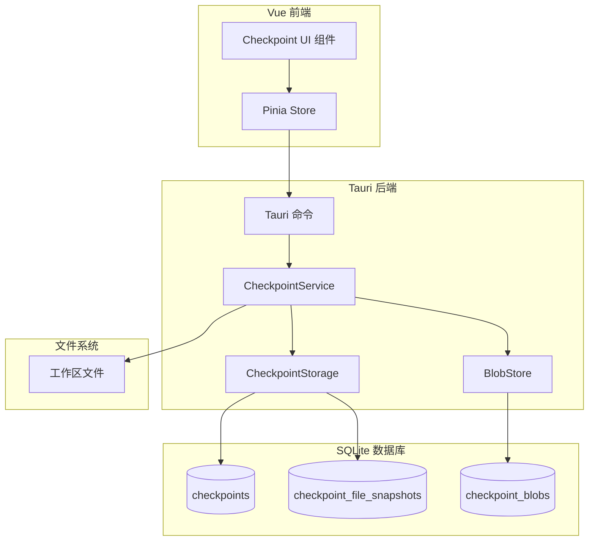

# Checkpoint 系统设计文档

## 概述

Checkpoint 系统为 OrbitX 提供类似 Git 的文件状态快照功能，允许用户在 AI 对话过程中自动保存文件状态并支持回滚。系统采用内容寻址存储（Content-Addressable Storage）来高效管理文件快照，使用树状结构追踪 checkpoint 之间的关系。

核心设计原则：

- **轻量级**: 仅存储变更文件，使用 SHA-256 去重
- **与现有架构集成**: 复用 SQLite 存储层和 Agent 持久化模式
- **事务安全**: 所有操作使用数据库事务保证一致性
- **异步优先**: 所有 I/O 操作使用 async/await

## 架构



### 数据流

1. **创建 Checkpoint**: 用户消息 → Agent 执行器 → CheckpointService.create() → 读取文件 → 计算 SHA-256 → 存储 Blob → 创建 Checkpoint 记录
2. **回滚**: UI → 命令 → CheckpointService.rollback() → 读取 Blob → 写入文件 → 创建新 Checkpoint
3. **查看历史**: UI → 命令 → CheckpointStorage.list() → 返回 Checkpoint 列表

## 组件与接口

### 1. CheckpointService（核心服务）

```rust
pub struct CheckpointService {
    storage: Arc<CheckpointStorage>,
    blob_store: Arc<BlobStore>,
}

impl CheckpointService {
    /// 创建新的 checkpoint
    pub async fn create_checkpoint(
        &self,
        conversation_id: i64,
        parent_id: Option<i64>,
        user_message: &str,
        files: Vec<PathBuf>,
    ) -> Result<Checkpoint>;

    /// 回滚到指定 checkpoint
    pub async fn rollback_to(
        &self,
        checkpoint_id: i64,
        workspace_path: &Path,
    ) -> Result<RollbackResult>;

    /// 获取 checkpoint 列表
    pub async fn list_checkpoints(
        &self,
        conversation_id: i64,
    ) -> Result<Vec<CheckpointSummary>>;

    /// 获取两个 checkpoint 之间的 diff
    pub async fn diff_checkpoints(
        &self,
        from_id: i64,
        to_id: i64,
    ) -> Result<Vec<FileDiff>>;

    /// 获取当前文件与 checkpoint 的 diff
    pub async fn diff_with_current(
        &self,
        checkpoint_id: i64,
        file_path: &Path,
        workspace_path: &Path,
    ) -> Result<String>;
}
```

### 2. CheckpointStorage（数据访问层）

```rust
pub struct CheckpointStorage {
    pool: SqlitePool,
}

impl CheckpointStorage {
    pub async fn insert_checkpoint(&self, checkpoint: &NewCheckpoint) -> Result<i64>;
    pub async fn get_checkpoint(&self, id: i64) -> Result<Option<Checkpoint>>;
    pub async fn list_by_conversation(&self, conversation_id: i64) -> Result<Vec<Checkpoint>>;
    pub async fn insert_file_snapshot(&self, snapshot: &FileSnapshot) -> Result<()>;
    pub async fn get_file_snapshots(&self, checkpoint_id: i64) -> Result<Vec<FileSnapshot>>;
    pub async fn delete_checkpoint(&self, id: i64) -> Result<()>;
}
```

### 3. BlobStore（内容寻址存储）

```rust
pub struct BlobStore {
    pool: SqlitePool,
}

impl BlobStore {
    /// 存储内容，返回 SHA-256 哈希
    pub async fn store(&self, content: &[u8]) -> Result<String>;

    /// 根据哈希获取内容
    pub async fn get(&self, hash: &str) -> Result<Option<Vec<u8>>>;

    /// 检查哈希是否存在
    pub async fn exists(&self, hash: &str) -> Result<bool>;

    /// 清理未引用的 blob
    pub async fn gc(&self) -> Result<u64>;
}
```

### 4. Tauri 命令

```rust
#[tauri::command]
pub async fn checkpoint_create(
    state: State<'_, CheckpointState>,
    conversation_id: i64,
    user_message: String,
) -> TauriApiResult<Checkpoint>;

#[tauri::command]
pub async fn checkpoint_list(
    state: State<'_, CheckpointState>,
    conversation_id: i64,
) -> TauriApiResult<Vec<CheckpointSummary>>;

#[tauri::command]
pub async fn checkpoint_rollback(
    state: State<'_, CheckpointState>,
    checkpoint_id: i64,
) -> TauriApiResult<RollbackResult>;

#[tauri::command]
pub async fn checkpoint_diff(
    state: State<'_, CheckpointState>,
    from_id: i64,
    to_id: i64,
) -> TauriApiResult<Vec<FileDiff>>;

#[tauri::command]
pub async fn checkpoint_get_file_content(
    state: State<'_, CheckpointState>,
    checkpoint_id: i64,
    file_path: String,
) -> TauriApiResult<Option<String>>;
```

## 数据模型

### 数据库表结构

```sql
-- Checkpoint 主表
CREATE TABLE IF NOT EXISTS checkpoints (
    id INTEGER PRIMARY KEY AUTOINCREMENT,
    conversation_id INTEGER NOT NULL,
    parent_id INTEGER,
    user_message TEXT NOT NULL,
    created_at INTEGER NOT NULL,
    FOREIGN KEY (conversation_id) REFERENCES conversations(id) ON DELETE CASCADE,
    FOREIGN KEY (parent_id) REFERENCES checkpoints(id) ON DELETE SET NULL
);

-- 文件快照表（记录每个 checkpoint 包含哪些文件）
CREATE TABLE IF NOT EXISTS checkpoint_file_snapshots (
    id INTEGER PRIMARY KEY AUTOINCREMENT,
    checkpoint_id INTEGER NOT NULL,
    file_path TEXT NOT NULL,
    blob_hash TEXT NOT NULL,
    change_type TEXT NOT NULL CHECK (change_type IN ('added', 'modified', 'deleted')),
    file_size INTEGER NOT NULL,
    created_at INTEGER NOT NULL,
    UNIQUE (checkpoint_id, file_path),
    FOREIGN KEY (checkpoint_id) REFERENCES checkpoints(id) ON DELETE CASCADE,
    FOREIGN KEY (blob_hash) REFERENCES checkpoint_blobs(hash)
);

-- Blob 存储表（内容寻址）
CREATE TABLE IF NOT EXISTS checkpoint_blobs (
    hash TEXT PRIMARY KEY,
    content BLOB NOT NULL,
    size INTEGER NOT NULL,
    ref_count INTEGER NOT NULL DEFAULT 1,
    created_at INTEGER NOT NULL
);

-- 索引
CREATE INDEX IF NOT EXISTS idx_checkpoints_conversation
    ON checkpoints(conversation_id, created_at DESC);
CREATE INDEX IF NOT EXISTS idx_file_snapshots_checkpoint
    ON checkpoint_file_snapshots(checkpoint_id);
CREATE INDEX IF NOT EXISTS idx_file_snapshots_blob
    ON checkpoint_file_snapshots(blob_hash);
```

### Rust 类型定义

```rust
#[derive(Debug, Clone, Serialize, Deserialize)]
pub struct Checkpoint {
    pub id: i64,
    pub conversation_id: i64,
    pub parent_id: Option<i64>,
    pub user_message: String,
    pub created_at: DateTime<Utc>,
}

#[derive(Debug, Clone, Serialize, Deserialize)]
pub struct CheckpointSummary {
    pub id: i64,
    pub conversation_id: i64,
    pub parent_id: Option<i64>,
    pub user_message: String,
    pub created_at: DateTime<Utc>,
    pub file_count: i64,
    pub total_size: i64,
}

#[derive(Debug, Clone, Serialize, Deserialize)]
pub struct FileSnapshot {
    pub id: i64,
    pub checkpoint_id: i64,
    pub file_path: String,
    pub blob_hash: String,
    pub change_type: FileChangeType,
    pub file_size: i64,
    pub created_at: DateTime<Utc>,
}

#[derive(Debug, Clone, Copy, Serialize, Deserialize, PartialEq, Eq)]
pub enum FileChangeType {
    Added,
    Modified,
    Deleted,
}

#[derive(Debug, Clone, Serialize, Deserialize)]
pub struct FileDiff {
    pub file_path: String,
    pub change_type: FileChangeType,
    pub diff_content: Option<String>,  // unified diff 格式
}

#[derive(Debug, Clone, Serialize, Deserialize)]
pub struct RollbackResult {
    pub checkpoint_id: i64,
    pub new_checkpoint_id: i64,
    pub restored_files: Vec<String>,
    pub failed_files: Vec<(String, String)>,  // (路径, 错误信息)
}
```

## 正确性属性

_属性是指在系统所有有效执行中都应保持为真的特征或行为——本质上是关于系统应该做什么的形式化陈述。属性是人类可读规范与机器可验证正确性保证之间的桥梁。_

基于需求分析，识别出以下属性。冗余属性已合并：

### 属性 1：Checkpoint 创建完整性

*对于任意*被追踪的文件集合和用户消息，创建 checkpoint 应当：

- 创建一条新的 checkpoint 记录，包含正确的 conversation_id 和父节点链接
- 为所有被追踪的文件创建快照，存储其完整内容
- 为每个文件正确分类变更类型（新增/修改/删除）

**验证需求: 1.1, 1.2, 1.3, 5.1, 5.2**

### 属性 2：内容寻址存储完整性

*对于任意*文件内容，存储到 BlobStore 应当：

- 产生确定性的 SHA-256 哈希值
- 允许使用该哈希值检索到完全相同的原始内容
- 当相同内容被多次存储时，不创建重复的 blob

**验证需求: 4.1, 4.2, 5.3**

### 属性 3：回滚往返一致性

_对于任意_ checkpoint，回滚到该 checkpoint 应当将所有被追踪的文件恢复到该 checkpoint 时的精确状态。具体来说：

- 对于 checkpoint 中的每个文件，回滚后的文件系统内容应当等于存储的快照内容
- 应当创建一个新的 checkpoint 表示回滚后的状态

**验证需求: 3.1, 3.2**

### 属性 4：Checkpoint 历史排序

*对于任意*包含多个 checkpoint 的会话，列出 checkpoint 应当按时间顺序返回（按 created_at 时间戳）。

**验证需求: 2.1**

### 属性 5：Diff 计算正确性

*对于任意*两个 checkpoint 或一个 checkpoint 与当前文件状态：

- 计算出的 diff 应当准确反映两个状态之间的差异
- diff 输出应当遵循 unified diff 格式（针对文本文件）
- 仅存在于一个状态中的文件应当被正确标识为新增或删除

**验证需求: 2.3, 7.1, 7.2**

### 属性 6：垃圾回收安全性

_对于任意_ checkpoint 删除操作，只有未被任何剩余 checkpoint 引用的 blob 才应被删除。被其他 checkpoint 引用的 blob 应当保持完整。

**验证需求: 4.3**

### 属性 7：Checkpoint 数据完整性

_对于任意_ checkpoint，查询其详情应当返回：

- checkpoint 时间戳
- 关联的用户消息
- 完整的修改文件列表及其变更类型

**验证需求: 2.2**

## 错误处理

### 文件系统错误

- **文件不存在**: 创建 checkpoint 时，跳过不存在的文件并记录警告
- **权限拒绝**: 向用户报告错误，继续处理其他文件
- **磁盘已满**: 中止 checkpoint 创建，回滚事务，报告错误

### 数据库错误

- **事务失败**: 回滚并重试一次，然后报告错误
- **约束违反**: 记录详细错误日志，中止操作
- **连接丢失**: 尝试重新连接，如可能则排队操作

### 回滚错误

- **部分失败**: 继续恢复剩余文件，在结果中报告失败的文件
- **Blob 未找到**: 严重错误，中止回滚，报告数据损坏

## 测试策略

### 属性测试库

使用 **proptest** crate 进行属性测试，配置每个测试运行至少 100 次迭代。

### 单元测试

- BlobStore 哈希计算
- FileChangeType 检测逻辑
- 已知输入的 Diff 生成
- 数据库 CRUD 操作

### 属性测试

每个正确性属性对应一个属性测试：

1. **属性 1 测试**: 生成随机文件集合和消息，验证 checkpoint 创建的完整性
2. **属性 2 测试**: 生成随机字节内容，验证存储和检索的一致性，以及去重
3. **属性 3 测试**: 创建 checkpoint，修改文件，回滚，验证文件内容恢复
4. **属性 4 测试**: 创建多个 checkpoint，验证列表顺序
5. **属性 5 测试**: 生成两个不同的文件状态，验证 diff 输出
6. **属性 6 测试**: 创建共享 blob 的 checkpoint，删除一个，验证 blob 保留
7. **属性 7 测试**: 创建 checkpoint，验证返回数据包含所有必需字段

### 测试注释格式

所有属性测试必须使用以下格式注释：

```rust
// **Feature: checkpoint-system, Property {number}: {property_text}**
// **Validates: Requirements X.Y**
```

### 集成测试

- 完整的 checkpoint 创建 → 修改 → 回滚流程
- 多会话并发 checkpoint 操作
- 大文件处理（>1MB）
