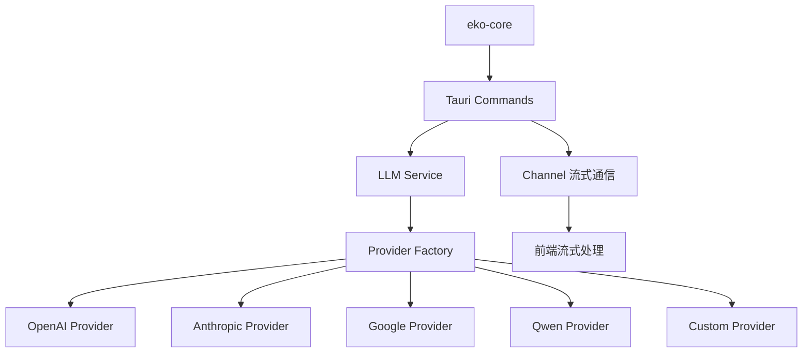
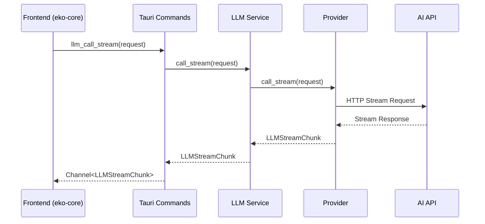

# 设计文档

## 概述

本设计文档描述了将 eko-core AI代理系统从 ai-sdk 完全迁移到原生后端接口的详细架构设计。该迁移将完全移除对所有 ai-sdk 包的依赖，直接使用统一的 Tauri 后端接口，不保留任何向后兼容性，实现完全的架构重构。

## 架构

### 当前架构

```mermaid
graph TD
    A[eko-core] --> B[ai-sdk/provider]
    A --> C[ai-sdk/openai]
    A --> D[ai-sdk/anthropic]
    A --> E[ai-sdk/google]
    A --> F[ai-sdk/amazon-bedrock]
    A --> G[@openrouter/ai-sdk-provider]
    A --> H[ai-sdk/openai-compatible]

    B --> I[HTTP 请求]
    C --> I
    D --> I
    E --> I
    F --> I
    G --> I
    H --> I
```

### 目标架构



### 数据流



## 组件和接口

### 1. 完全重构的类型系统

#### 原生类型定义

```typescript
// 核心消息类型
export interface NativeLLMMessage {
  role: 'system' | 'user' | 'assistant' | 'tool'
  content: string | NativeLLMMessagePart[]
}

export interface NativeLLMMessagePart {
  type: 'text' | 'file' | 'tool-call' | 'tool-result'
  text?: string
  mimeType?: string
  data?: string
  toolCallId?: string
  toolName?: string
  args?: Record<string, unknown>
  result?: string | Record<string, unknown>
}

// 工具类型
export interface NativeLLMTool {
  name: string
  description: string
  parameters: any
}

export interface NativeLLMToolCall {
  id: string
  name: string
  arguments: any
}

// 请求和响应类型
export interface NativeLLMRequest {
  model: string
  messages: NativeLLMMessage[]
  temperature?: number
  maxTokens?: number
  tools?: NativeLLMTool[]
  toolChoice?: string
  stream: boolean
  abortSignal?: AbortSignal
}

export interface NativeLLMResponse {
  content: string
  finishReason: string
  toolCalls?: NativeLLMToolCall[]
  usage?: NativeLLMUsage
}

export interface NativeLLMUsage {
  promptTokens: number
  completionTokens: number
  totalTokens: number
}

// 流式数据类型
export type NativeLLMStreamChunk =
  | { type: 'delta'; content?: string; toolCalls?: NativeLLMToolCall[] }
  | { type: 'finish'; finishReason: string; usage?: NativeLLMUsage }
  | { type: 'error'; error: string }
```

#### 简化的配置类型

```typescript
export type LLMConfig = {
  modelId: string
  temperature?: number
  maxTokens?: number
}

export type LLMs = {
  default: LLMConfig
  [key: string]: LLMConfig
}

export type FinishReason = 'stop' | 'length' | 'tool_calls' | 'content_filter'

// 生成结果类型
export type GenerateResult = {
  modelId: string
  content: string
  finishReason: FinishReason
  usage: NativeLLMUsage
  toolCalls?: NativeLLMToolCall[]
}

// 流式结果类型
export type StreamResult = {
  modelId: string
  stream: ReadableStream<NativeLLMStreamChunk>
}
```

### 2. LLM 服务层

#### NativeLLMService 类

```typescript
export class NativeLLMService {
  async call(request: NativeLLMRequest): Promise<NativeLLMResponse> {
    return await invoke('llm_call', { request })
  }

  async callStream(request: NativeLLMRequest): Promise<ReadableStream<NativeLLMStreamChunk>> {
    const channel = new Channel<NativeLLMStreamChunk>()
    await invoke('llm_call_stream', { request, onChunk: channel })
    return this.createStreamFromChannel(channel)
  }

  async getAvailableModels(): Promise<string[]> {
    return await invoke('llm_get_available_models')
  }

  async testModelConnection(modelId: string): Promise<boolean> {
    return await invoke('llm_test_model_connection', { modelId })
  }

  private createStreamFromChannel(channel: Channel<NativeLLMStreamChunk>): ReadableStream<NativeLLMStreamChunk> {
    return new ReadableStream({
      start(controller) {
        channel.onmessage = chunk => {
          controller.enqueue(chunk)
          if (chunk.type === 'finish' || chunk.type === 'error') {
            controller.close()
          }
        }
      },
    })
  }
}
```

#### RetryLanguageModel 完全重构

```typescript
export class RetryLanguageModel {
  private nativeService: NativeLLMService
  private llms: LLMs
  private names: string[]

  constructor(llms: LLMs, names?: string[]) {
    this.nativeService = new NativeLLMService()
    this.llms = llms
    this.names = names || ['default']
  }

  async call(request: NativeLLMRequest): Promise<GenerateResult> {
    for (const name of this.names) {
      const config = this.llms[name]
      if (!config) continue

      try {
        const nativeRequest = this.buildRequest(request, config)
        const response = await this.nativeService.call(nativeRequest)

        return {
          modelId: config.modelId,
          content: response.content,
          finishReason: response.finishReason as FinishReason,
          usage: response.usage || { promptTokens: 0, completionTokens: 0, totalTokens: 0 },
          toolCalls: response.toolCalls,
        }
      } catch (error) {
        console.error(`LLM call failed for ${name}:`, error)
        continue
      }
    }
    throw new Error('All LLM providers failed')
  }

  async callStream(request: NativeLLMRequest): Promise<StreamResult> {
    for (const name of this.names) {
      const config = this.llms[name]
      if (!config) continue

      try {
        const nativeRequest = this.buildRequest(request, config)
        const stream = await this.nativeService.callStream(nativeRequest)

        return {
          modelId: config.modelId,
          stream,
        }
      } catch (error) {
        console.error(`LLM stream call failed for ${name}:`, error)
        continue
      }
    }
    throw new Error('All LLM providers failed')
  }

  private buildRequest(request: NativeLLMRequest, config: LLMConfig): NativeLLMRequest {
    return {
      ...request,
      model: config.modelId,
      temperature: request.temperature ?? config.temperature,
      maxTokens: request.maxTokens ?? config.maxTokens,
    }
  }
}
```

### 3. 流式数据处理

#### 直接使用原生流式类型

```typescript
export class StreamProcessor {
  static processStreamChunk(chunk: NativeLLMStreamChunk): void {
    switch (chunk.type) {
      case 'delta':
        // 处理内容增量
        if (chunk.content) {
          this.handleTextDelta(chunk.content)
        }
        if (chunk.toolCalls) {
          this.handleToolCalls(chunk.toolCalls)
        }
        break
      case 'finish':
        this.handleFinish(chunk.finishReason, chunk.usage)
        break
      case 'error':
        this.handleError(chunk.error)
        break
    }
  }

  private static handleTextDelta(content: string): void {
    // 处理文本增量
  }

  private static handleToolCalls(toolCalls: NativeLLMToolCall[]): void {
    // 处理工具调用
  }

  private static handleFinish(finishReason: string, usage?: NativeLLMUsage): void {
    // 处理完成事件
  }

  private static handleError(error: string): void {
    // 处理错误
  }
}
```

### 4. 工具调用系统

#### 直接使用原生工具类型

```typescript
// 工具接口重构
export interface Tool {
  readonly name: string
  readonly description?: string
  readonly parameters: any // 直接使用 JSONSchema
  execute: (args: Record<string, unknown>, toolCall: NativeLLMToolCall) => Promise<ToolResult>
}

export interface DialogueTool {
  readonly name: string
  readonly description?: string
  readonly parameters: any
  execute: (args: Record<string, unknown>, toolCall: NativeLLMToolCall) => Promise<ToolResult>
}

// 工具转换函数
export function convertTools(tools: Tool[] | DialogueTool[]): NativeLLMTool[] {
  return tools.map(tool => ({
    name: tool.name,
    description: tool.description || '',
    parameters: tool.parameters,
  }))
}

export function convertToolResult(toolCall: NativeLLMToolCall, toolResult: ToolResult): NativeLLMMessagePart {
  return {
    type: 'tool-result',
    toolCallId: toolCall.id,
    toolName: toolCall.name,
    result:
      toolResult.content.length === 1 && toolResult.content[0].type === 'text'
        ? toolResult.content[0].text
        : toolResult.content,
  }
}
```

### 5. 错误处理

#### 简化的错误处理

```typescript
export class LLMError extends Error {
  constructor(
    message: string,
    public readonly category: 'network' | 'auth' | 'rate_limit' | 'model' | 'unknown' = 'unknown',
    public readonly retryable: boolean = false
  ) {
    super(message)
    this.name = 'LLMError'
  }
}

export class ErrorHandler {
  static handleError(error: string): LLMError {
    if (error.includes('rate limit')) {
      return new LLMError(error, 'rate_limit', true)
    }
    if (error.includes('unauthorized') || error.includes('invalid api key')) {
      return new LLMError(error, 'auth', false)
    }
    if (error.includes('network') || error.includes('timeout')) {
      return new LLMError(error, 'network', true)
    }
    if (error.includes('model not found')) {
      return new LLMError(error, 'model', false)
    }
    return new LLMError(error, 'unknown', true)
  }

  static shouldRetry(error: LLMError, retryCount: number): boolean {
    return error.retryable && retryCount < 3
  }

  static getRetryDelay(retryCount: number): number {
    return Math.min(1000 * Math.pow(2, retryCount), 10000)
  }
}
```

## 数据模型

### 消息格式

#### 统一使用原生格式

```typescript
// 文本消息
{
  role: 'user',
  content: 'Hello, how are you?'
}

// 多模态消息
{
  role: 'user',
  content: [
    { type: 'text', text: 'What is in this image?' },
    { type: 'file', data: 'base64...', mimeType: 'image/png' }
  ]
}

// 工具调用消息
{
  role: 'assistant',
  content: [
    { type: 'text', text: 'I will search for that information.' },
    {
      type: 'tool-call',
      toolCallId: 'call_123',
      toolName: 'search',
      args: { query: 'hello world' }
    }
  ]
}

// 工具结果消息
{
  role: 'tool',
  content: [
    {
      type: 'tool-result',
      toolCallId: 'call_123',
      toolName: 'search',
      result: 'Search results: ...'
    }
  ]
}
```

### 流式数据格式

```typescript
// 文本增量
{ type: 'delta', content: 'Hello' }

// 工具调用
{
  type: 'delta',
  toolCalls: [{
    id: 'call_123',
    name: 'search',
    arguments: { query: 'hello' }
  }]
}

// 完成
{
  type: 'finish',
  finishReason: 'stop',
  usage: {
    promptTokens: 10,
    completionTokens: 20,
    totalTokens: 30
  }
}

// 错误
{ type: 'error', error: 'Rate limit exceeded' }
```

## 错误处理

### 错误分类和处理策略

1. **网络错误**: 指数退避重试，最多3次
2. **认证错误**: 立即失败，提示用户检查API密钥
3. **速率限制**: 延迟重试
4. **模型错误**: 尝试备用模型
5. **未知错误**: 重试一次后失败

## 测试策略

### 单元测试

1. **原生类型测试**: 验证所有原生类型的正确性
2. **流式数据测试**: 验证流式数据的正确处理
3. **错误处理测试**: 验证各种错误情况的正确处理
4. **工具调用测试**: 验证工具调用的正确执行

### 集成测试

1. **端到端测试**: 验证完整的LLM调用流程
2. **多模型测试**: 验证不同LLM提供商的兼容性
3. **并发测试**: 验证多个并发请求的正确处理
4. **错误恢复测试**: 验证错误恢复机制的有效性

### 性能测试

1. **响应时间测试**: 验证响应时间符合预期
2. **内存使用测试**: 验证内存使用合理
3. **并发性能测试**: 验证高并发场景下的性能
4. **流式延迟测试**: 验证流式数据的延迟

## 迁移策略

### 完全重构方法

1. **阶段1**: 类型定义完全重构
2. **阶段2**: LLM核心模块完全重写
3. **阶段3**: Agent模块完全重构
4. **阶段4**: 核心模块完全重构
5. **阶段5**: 工具和内存模块完全重构
6. **阶段6**: 测试和验证

### 依赖清理

迁移完成后移除的依赖：

- `@ai-sdk/provider`
- `@ai-sdk/openai`
- `@ai-sdk/anthropic`
- `@ai-sdk/google`
- `@ai-sdk/amazon-bedrock`
- `@openrouter/ai-sdk-provider`
- `@ai-sdk/openai-compatible`

## 性能优化

### 流式数据优化

1. **直接处理**: 直接处理原生流式数据，无转换开销
2. **背压处理**: 实现适当的背压机制
3. **内存管理**: 及时清理流式资源

### 架构优化

1. **简化架构**: 移除中间层，直接调用后端
2. **类型安全**: 完全的TypeScript类型安全
3. **性能提升**: 减少类型转换和包装开销
