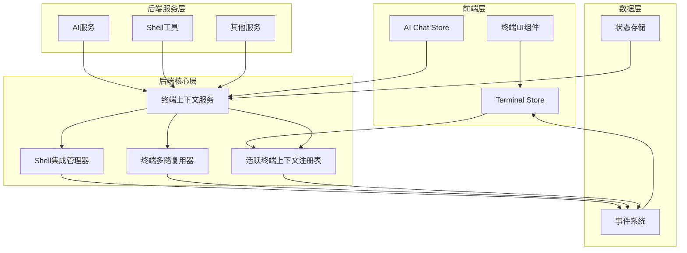

# 终端上下文重构设计文档

## 概述

本设计文档基于需求分析，提供了一个全面的解决方案来重构 OrbitX 的终端上下文管理系统。设计的核心原则是建立后端作为终端状态的单一数据源，消除前后端耦合，并提供统一的上下文访问接口。

## 架构设计

### 整体架构图



### 核心组件设计

#### 1. 活跃终端上下文注册表 (ActiveTerminalContextRegistry)

**职责:**

- 维护当前活跃终端的状态
- 提供线程安全的活跃终端查询和更新
- 支持多窗口/多会话的活跃终端管理

**接口设计:**

```rust
pub struct ActiveTerminalContextRegistry {
    // 全局活跃终端
    global_active_pane: Arc<RwLock<Option<PaneId>>>,
    // 按窗口分组的活跃终端（未来扩展）
    window_active_panes: Arc<RwLock<HashMap<WindowId, PaneId>>>,
    // 事件发送器
    event_sender: Sender<ContextEvent>,
}

impl ActiveTerminalContextRegistry {
    pub fn set_active_pane(&self, pane_id: PaneId) -> Result<(), ContextError>;
    pub fn get_active_pane(&self) -> Option<PaneId>;
    pub fn clear_active_pane(&self) -> Result<(), ContextError>;
    pub fn is_pane_active(&self, pane_id: PaneId) -> bool;

    // 未来扩展：多窗口支持
    pub fn set_window_active_pane(&self, window_id: WindowId, pane_id: PaneId) -> Result<(), ContextError>;
    pub fn get_window_active_pane(&self, window_id: WindowId) -> Option<PaneId>;
}
```

#### 2. 终端上下文服务 (TerminalContextService)

**职责:**

- 提供统一的终端上下文访问接口
- 整合来自多个数据源的终端信息
- 实现上下文缓存和性能优化
- 处理上下文查询的错误和回退逻辑

**接口设计:**

```rust
#[derive(Debug, Clone)]
pub struct TerminalContext {
    pub pane_id: PaneId,
    pub current_working_directory: Option<String>,
    pub shell_type: Option<ShellType>,
    pub shell_integration_enabled: bool,
    pub current_command: Option<CommandInfo>,
    pub command_history: Vec<CommandInfo>,
    pub last_activity: SystemTime,
}

pub struct TerminalContextService {
    registry: Arc<ActiveTerminalContextRegistry>,
    shell_integration: Arc<ShellIntegrationManager>,
    terminal_mux: Arc<TerminalMux>,
    cache: Arc<RwLock<HashMap<PaneId, CachedContext>>>,
}

impl TerminalContextService {
    // 核心查询方法
    pub async fn get_active_context(&self) -> Result<TerminalContext, ContextError>;
    pub async fn get_context_by_pane(&self, pane_id: PaneId) -> Result<TerminalContext, ContextError>;
    pub async fn get_context_with_fallback(&self, pane_id: Option<PaneId>) -> Result<TerminalContext, ContextError>;

    // 特定信息查询
    pub async fn get_active_cwd(&self) -> Result<String, ContextError>;
    pub async fn get_pane_cwd(&self, pane_id: PaneId) -> Result<String, ContextError>;
    pub async fn get_active_shell_type(&self) -> Result<ShellType, ContextError>;

    // 缓存管理
    pub fn invalidate_cache(&self, pane_id: PaneId);
    pub fn clear_all_cache(&self);
    pub fn get_cache_stats(&self) -> CacheStats;
}
```

#### 3. 重构后的 AI 上下文构建

**变更:**

- 移除 `currentWorkingDirectory` 参数
- 添加可选的 `pane_id` 参数
- 使用 `TerminalContextService` 自动解析上下文

**新接口设计:**

```rust
// 新的 AI 命令接口
#[tauri::command]
pub async fn build_prompt_with_context(
    conversation_id: i64,
    current_message: String,
    up_to_message_id: Option<i64>,
    pane_id: Option<u32>, // 新增：可选的面板ID
    tag_context: Option<serde_json::Value>,
    state: State<'_, AIManagerState>,
) -> Result<String, String> {
    // 使用 TerminalContextService 解析上下文
    let context_service = state.get_terminal_context_service();
    let terminal_context = if let Some(pane_id) = pane_id {
        context_service.get_context_by_pane(PaneId::new(pane_id)).await?
    } else {
        context_service.get_active_context().await?
    };

    // 构建智能提示，使用解析得到的上下文
    let intelligent_prompt = crate::ai::context::build_intelligent_prompt_with_context(
        repositories,
        conversation_id,
        &current_message,
        up_to_message_id,
        &terminal_context,
        tag_context,
    ).await?;

    Ok(intelligent_prompt)
}
```

#### 4. 事件系统整合

**设计原则:**

- 单一事件源：所有终端相关事件都通过 `TerminalMux` 发出
- 清晰的事件类型：使用强类型的事件结构
- 统一的 Tauri 集成：移除重复的事件处理逻辑

**事件流设计:**

```rust
// 统一的事件类型
#[derive(Debug, Clone)]
pub enum TerminalContextEvent {
    ActivePaneChanged {
        old_pane_id: Option<PaneId>,
        new_pane_id: Option<PaneId>
    },
    PaneContextUpdated {
        pane_id: PaneId,
        context: TerminalContext
    },
    PaneCwdChanged {
        pane_id: PaneId,
        old_cwd: Option<String>,
        new_cwd: String
    },
    PaneShellIntegrationChanged {
        pane_id: PaneId,
        enabled: bool
    },
}

// 统一的事件处理器
pub struct TerminalEventHandler {
    tauri_app: AppHandle,
}

impl TerminalEventHandler {
    pub fn handle_context_event(&self, event: TerminalContextEvent) {
        match event {
            TerminalContextEvent::ActivePaneChanged { new_pane_id, .. } => {
                self.emit_tauri_event("active_pane_changed", json!({
                    "pane_id": new_pane_id.map(|id| id.as_u32())
                }));
            },
            TerminalContextEvent::PaneCwdChanged { pane_id, new_cwd, .. } => {
                self.emit_tauri_event("pane_cwd_changed", json!({
                    "pane_id": pane_id.as_u32(),
                    "cwd": new_cwd
                }));
            },
            // ... 其他事件处理
        }
    }
}
```

## 组件和接口

### 新增 Tauri 命令

```rust
// 活跃终端管理
#[tauri::command]
pub async fn set_active_pane(
    pane_id: u32,
    state: State<'_, TerminalContextState>,
) -> Result<(), String>;

#[tauri::command]
pub async fn get_active_pane(
    state: State<'_, TerminalContextState>,
) -> Result<Option<u32>, String>;

// 终端上下文查询
#[tauri::command]
pub async fn get_terminal_context(
    pane_id: Option<u32>,
    state: State<'_, TerminalContextState>,
) -> Result<TerminalContext, String>;

#[tauri::command]
pub async fn get_active_terminal_context(
    state: State<'_, TerminalContextState>,
) -> Result<TerminalContext, String>;
```

### 前端适配层

```typescript
// 新的终端上下文 API
export class TerminalContextApi {
  // 活跃终端管理
  async setActivePaneId(paneId: number): Promise<void> {
    return invoke('set_active_pane', { paneId })
  }

  async getActivePaneId(): Promise<number | null> {
    return invoke('get_active_pane')
  }

  // 上下文查询
  async getTerminalContext(paneId?: number): Promise<TerminalContext> {
    return invoke('get_terminal_context', { paneId })
  }

  async getActiveTerminalContext(): Promise<TerminalContext> {
    return invoke('get_active_terminal_context')
  }
}

// 重构后的 AI API
export class AiApi {
  async buildPromptWithContext(
    conversationId: number,
    content: string,
    userMessageId: number,
    paneId?: number, // 新增：可选的面板ID
    tagContext?: any
  ): Promise<string> {
    return invoke('build_prompt_with_context', {
      conversationId,
      currentMessage: content,
      upToMessageId: userMessageId,
      paneId, // 传递面板ID而不是CWD
      tagContext,
    })
  }
}
```

## 数据模型

### 终端上下文数据结构

```rust
#[derive(Debug, Clone, Serialize, Deserialize)]
pub struct TerminalContext {
    pub pane_id: PaneId,
    pub current_working_directory: Option<String>,
    pub shell_type: Option<ShellType>,
    pub shell_integration_enabled: bool,
    pub current_command: Option<CommandInfo>,
    pub command_history: Vec<CommandInfo>,
    pub window_title: Option<String>,
    pub last_activity: SystemTime,
    pub is_active: bool,
}

#[derive(Debug, Clone)]
pub struct CachedContext {
    pub context: TerminalContext,
    pub cached_at: Instant,
    pub ttl: Duration,
}

#[derive(Debug, Clone)]
pub struct CacheStats {
    pub total_entries: usize,
    pub hit_count: u64,
    pub miss_count: u64,
    pub eviction_count: u64,
    pub hit_rate: f64,
}
```

### 错误处理

```rust
#[derive(Debug, thiserror::Error)]
pub enum ContextError {
    #[error("面板不存在: {pane_id}")]
    PaneNotFound { pane_id: PaneId },

    #[error("没有活跃的终端")]
    NoActivePane,

    #[error("上下文信息不完整: {reason}")]
    IncompleteContext { reason: String },

    #[error("Shell集成未启用")]
    ShellIntegrationDisabled,

    #[error("上下文查询超时")]
    QueryTimeout,

    #[error("内部错误: {source}")]
    Internal { source: anyhow::Error },
}
```

## 错误处理

### 错误处理策略

1. **优雅降级**: 当无法获取完整上下文时，提供部分信息或合理默认值
2. **重试机制**: 对于临时性错误，实现自动重试
3. **缓存回退**: 当实时查询失败时，使用缓存的上下文信息
4. **用户友好**: 向用户提供清晰的错误信息和建议操作

### 错误处理实现

```rust
impl TerminalContextService {
    pub async fn get_context_with_fallback(&self, pane_id: Option<PaneId>) -> Result<TerminalContext, ContextError> {
        // 1. 尝试获取指定面板的上下文
        if let Some(pane_id) = pane_id {
            if let Ok(context) = self.get_context_by_pane(pane_id).await {
                return Ok(context);
            }
        }

        // 2. 回退到活跃终端
        if let Ok(context) = self.get_active_context().await {
            return Ok(context);
        }

        // 3. 使用缓存的上下文
        if let Some(cached_context) = self.get_any_cached_context() {
            return Ok(cached_context);
        }

        // 4. 创建默认上下文
        Ok(self.create_default_context())
    }

    fn create_default_context(&self) -> TerminalContext {
        TerminalContext {
            pane_id: PaneId::new(0),
            current_working_directory: Some("~".to_string()),
            shell_type: Some(ShellType::Bash),
            shell_integration_enabled: false,
            current_command: None,
            command_history: Vec::new(),
            window_title: None,
            last_activity: SystemTime::now(),
            is_active: false,
        }
    }
}
```

## 测试策略

### 单元测试

1. **活跃终端注册表测试**
   - 设置和获取活跃终端
   - 并发访问安全性
   - 事件发送正确性

2. **终端上下文服务测试**
   - 上下文查询的各种场景
   - 缓存机制的正确性
   - 错误处理和回退逻辑

3. **AI 上下文构建测试**
   - 新接口的功能正确性
   - 向后兼容性验证
   - 错误场景处理

### 集成测试

1. **端到端上下文流测试**
   - 前端切换终端 → 后端更新活跃状态 → AI 获取正确上下文
   - CWD 变化 → 事件传播 → 前端UI更新

2. **性能测试**
   - 上下文查询响应时间
   - 并发访问性能
   - 缓存效果验证

### 兼容性测试

1. **API 兼容性测试**
   - 现有前端代码继续工作
   - 弃用警告正确显示
   - 新旧API行为一致性

## 性能考虑

### 缓存策略

1. **多级缓存**
   - L1: 内存缓存（最近访问的上下文）
   - L2: 进程内共享缓存
   - TTL: 基于数据类型的不同过期时间

2. **缓存失效策略**
   - 主动失效：当终端状态变化时
   - 被动失效：基于TTL的自动过期
   - 容量限制：LRU淘汰策略

### 并发控制

1. **读写锁优化**
   - 读多写少的场景使用 RwLock
   - 关键路径使用无锁数据结构
   - 避免长时间持有锁

2. **异步处理**
   - 上下文查询使用异步接口
   - 事件处理异步化
   - 避免阻塞主线程

## 迁移计划

### 阶段 1: 基础设施建设（1-2周）

1. 实现 `ActiveTerminalContextRegistry`
2. 实现 `TerminalContextService` 基础功能
3. 添加新的 Tauri 命令
4. 建立事件系统整合框架

### 阶段 2: 核心功能迁移（2-3周）

1. 重构 AI 上下文构建逻辑
2. 更新 Shell 工具使用新的上下文服务
3. 实现前端适配层
4. 添加向后兼容性支持

### 阶段 3: 前端集成（1-2周）

1. 更新前端 Terminal Store
2. 修改 AI Chat Store 调用方式
3. 移除前端 CWD 回写逻辑
4. 更新事件监听逻辑

### 阶段 4: 测试和优化（1-2周）

1. 全面测试新系统
2. 性能优化和调优
3. 文档更新
4. 准备弃用旧API

### 阶段 5: 清理和发布（1周）

1. 移除重复的事件处理代码
2. 清理临时兼容性代码
3. 最终测试和验证
4. 发布和文档更新
