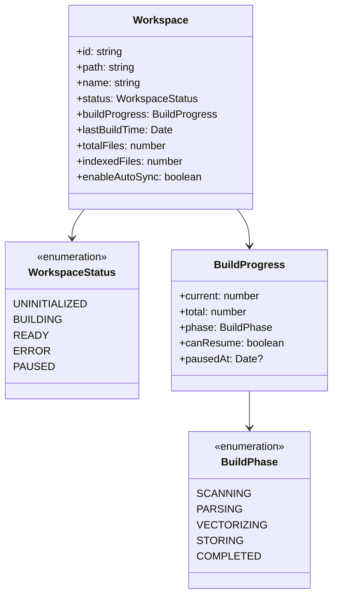
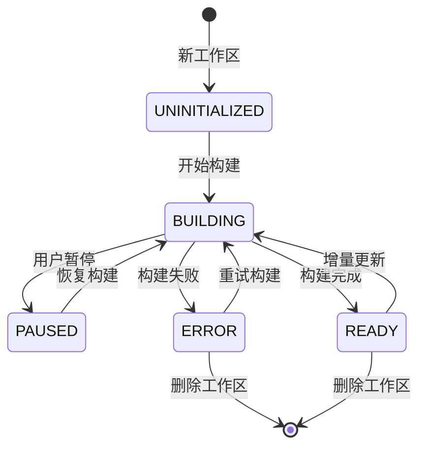
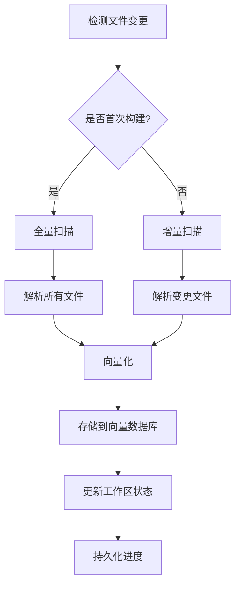

# 统一工作区向量数据库管理系统重构方案

## 概述

通过分析现有代码实现，发现你已经具备了大部分核心功能的基础架构，只是概念上被分割成了独立模块。本方案基于现有实现进行统一重构，避免重复开发。

## 现有功能实现分析

### ✅ 已实现的核心功能

#### 1. 增量更新机制

- **文件监控**: `FileMonitorService` 已实现基于 `notify` 的文件变更监控
- **增量更新器**: `IncrementalUpdater` 支持单文件和批量文件更新
- **变更检测**: `FileChangeDetector` 实现防抖和事件聚合
- **文件过滤**: `FileFilter` 支持按文件类型和路径过滤

#### 2. 取消/暂停机制

- **取消标志**: `AtomicBool cancel_flag` 实现构建过程取消
- **任务协调器**: `TaskCoordinator` 支持任务状态管理
- **进度报告**: 实时进度事件通知机制
- **错误处理**: 完整的错误恢复和状态管理

#### 3. 状态持久化

- **MessagePack存储**: 支持状态序列化和备份恢复
- **配置管理**: `VectorIndexConfigService` 配置持久化
- **会话状态**: `SessionState` 管理系统状态

#### 4. 工作区管理基础

- **工作区路径获取**: `get_current_workspace_path`
- **目录扫描**: `CodeFileScanner` 递归扫描代码文件
- **工作区设置API**: `VectorIndexAppSettingsApi` 管理工作区列表

### ❌ 缺失的功能

#### 1. 构建断点续传

- 缺少构建检查点数据结构
- 没有断点恢复逻辑
- 构建状态无法持久化到数据库

#### 2. 统一的工作区状态

- 工作区状态分散在多个地方
- 缺少统一的工作区生命周期管理
- 构建状态与工作区配置未关联

#### 3. 前端状态同步

- AI聊天界面与设置页面状态割裂
- 缺少全局工作区状态管理
- 构建完成后工作区列表未自动更新

## 重构方案: 基于现有架构的统一整合

### 核心原则

- 保持现有代码结构，避免大规模重写
- 复用已实现的增量更新和文件监控
- 统一工作区概念，消除概念分裂
- 简化前端API，提供一致的用户体验

## 重构架构设计

### 核心概念统一

**统一概念**: "工作区" = 包含代码的目录 + 对应的向量数据库



### 统一状态管理



## 核心功能设计

### 1. 工作区生命周期管理

```typescript
interface WorkspaceManager {
  // 工作区基础操作
  createWorkspace(path: string, name?: string): Promise<Workspace>
  removeWorkspace(id: string): Promise<void>
  listWorkspaces(): Promise<Workspace[]>
  getWorkspace(id: string): Promise<Workspace | null>

  // 构建操作
  startBuild(workspaceId: string): Promise<void>
  pauseBuild(workspaceId: string): Promise<void>
  resumeBuild(workspaceId: string): Promise<void>
  cancelBuild(workspaceId: string): Promise<void>

  // 增量更新
  syncWorkspace(workspaceId: string): Promise<void>
  enableAutoSync(workspaceId: string, enabled: boolean): Promise<void>
}
```

### 2. 增量构建机制



### 3. 断点续传设计

```typescript
interface BuildCheckpoint {
  workspaceId: string
  phase: BuildPhase
  processedFiles: string[]
  totalFiles: string[]
  lastProcessedFile: string
  timestamp: Date
  canResume: boolean
}

interface BuildResumer {
  saveCheckpoint(checkpoint: BuildCheckpoint): Promise<void>
  loadCheckpoint(workspaceId: string): Promise<BuildCheckpoint | null>
  resumeFromCheckpoint(workspaceId: string): Promise<void>
  clearCheckpoint(workspaceId: string): Promise<void>
}
```

## 简化实现方案

### 前端统一API

```typescript
// 统一的工作区API
class WorkspaceAPI {
  // 替代原有的 vectorIndexApi 和 vectorIndexAppSettingsApi
  async listWorkspaces(): Promise<Workspace[]>
  async createWorkspace(path: string): Promise<Workspace>
  async deleteWorkspace(id: string): Promise<void>

  // 构建控制
  async startBuild(id: string): Promise<void>
  async pauseBuild(id: string): Promise<void>
  async resumeBuild(id: string): Promise<void>

  // 状态监听
  onWorkspaceStatusChange(callback: (workspace: Workspace) => void): void
  onBuildProgress(callback: (progress: BuildProgress) => void): void
}
```

### 后端统一服务

```rust
// 统一的工作区服务
pub struct WorkspaceService {
    storage: Arc<WorkspaceStorage>,
    vector_service: Arc<VectorIndexService>,
    file_monitor: Arc<FileMonitorService>,
    checkpoint_manager: Arc<CheckpointManager>,
}

impl WorkspaceService {
    pub async fn create_workspace(&self, path: &str) -> Result<Workspace> {
        // 1. 验证路径
        // 2. 创建工作区记录
        // 3. 初始化向量数据库collection
        // 4. 保存到存储
    }

    pub async fn start_build(&self, workspace_id: &str) -> Result<()> {
        // 1. 检查是否可以恢复
        // 2. 启动增量构建
        // 3. 定期保存检查点
    }

    pub async fn resume_build(&self, workspace_id: &str) -> Result<()> {
        // 1. 加载检查点
        // 2. 从断点继续
    }
}
```

## SQLite数据库持久化方案

### 极简设计: **只需要1个核心表**

经过深思熟虑，你的核心问题是：**构建索引完成后，工作目录列表不更新**。本质上只需要一个工作区状态表即可解决。

**删除理由分析**:

- **`vector_build_checkpoints`表** → ❌ 删除，你已有完整的取消机制，断点续传可以通过文件扫描重新开始，无需复杂的检查点
- **`vector_file_index`表** → ❌ 删除，你已有`FileMonitorService`实时监控文件变更，无需数据库存储文件哈希

```sql
-- ==============================================
-- 极简工作区管理表 - 只有1个表解决核心问题
-- ==============================================

CREATE TABLE IF NOT EXISTS vector_workspaces (
    -- 唯一标识
    id TEXT PRIMARY KEY,                          -- 工作区UUID
    path TEXT UNIQUE NOT NULL,                   -- 工作区路径（核心标识）
    name TEXT NOT NULL,                          -- 显示名称

    -- 核心状态
    status TEXT NOT NULL DEFAULT 'uninitialized' -- 工作区状态
        CHECK (status IN ('uninitialized', 'building', 'ready', 'error')),

    -- 时间戳
    created_at DATETIME DEFAULT CURRENT_TIMESTAMP,
    updated_at DATETIME DEFAULT CURRENT_TIMESTAMP
);
```

## 实现任务

### 1. 数据库表创建

**任务**: 在 `src-tauri/sql/01_tables.sql` 中添加工作区表

```sql
-- 在文件末尾添加
CREATE TABLE IF NOT EXISTS vector_workspaces (
    id TEXT PRIMARY KEY,
    path TEXT UNIQUE NOT NULL,
    name TEXT NOT NULL,
    status TEXT NOT NULL DEFAULT 'uninitialized'
        CHECK (status IN ('uninitialized', 'building', 'ready', 'error')),
    created_at DATETIME DEFAULT CURRENT_TIMESTAMP,
    updated_at DATETIME DEFAULT CURRENT_TIMESTAMP
);

CREATE INDEX IF NOT EXISTS idx_vector_workspaces_path
    ON vector_workspaces(path);

CREATE TRIGGER IF NOT EXISTS trigger_vector_workspaces_updated_at
AFTER UPDATE ON vector_workspaces
FOR EACH ROW
BEGIN
    UPDATE vector_workspaces
    SET updated_at = CURRENT_TIMESTAMP
    WHERE id = NEW.id;
END;
```

### 2. Repository实现

**任务**: 创建 `src-tauri/src/storage/repositories/vector_workspaces.rs`

```rust
use super::{Repository, RowMapper};
use crate::storage::database::DatabaseManager;
use crate::utils::error::AppResult;
use anyhow::anyhow;
use chrono::{DateTime, Utc};
use serde::{Deserialize, Serialize};
use sqlx::Row;
use std::sync::Arc;

#[derive(Debug, Clone, Serialize, Deserialize)]
#[serde(rename_all = "lowercase")]
pub enum WorkspaceStatus {
    Uninitialized,
    Building,
    Ready,
    Error,
}

impl std::fmt::Display for WorkspaceStatus {
    fn fmt(&self, f: &mut std::fmt::Formatter<'_>) -> std::fmt::Result {
        match self {
            WorkspaceStatus::Uninitialized => write!(f, "uninitialized"),
            WorkspaceStatus::Building => write!(f, "building"),
            WorkspaceStatus::Ready => write!(f, "ready"),
            WorkspaceStatus::Error => write!(f, "error"),
        }
    }
}

impl std::str::FromStr for WorkspaceStatus {
    type Err = anyhow::Error;

    fn from_str(s: &str) -> Result<Self, Self::Err> {
        match s {
            "uninitialized" => Ok(WorkspaceStatus::Uninitialized),
            "building" => Ok(WorkspaceStatus::Building),
            "ready" => Ok(WorkspaceStatus::Ready),
            "error" => Ok(WorkspaceStatus::Error),
            _ => Err(anyhow!("Invalid workspace status: {}", s)),
        }
    }
}

#[derive(Debug, Clone, Serialize, Deserialize)]
#[serde(rename_all = "camelCase")]
pub struct VectorWorkspace {
    pub id: String,
    pub path: String,
    pub name: String,
    pub status: WorkspaceStatus,
    pub created_at: DateTime<Utc>,
    pub updated_at: DateTime<Utc>,
}

impl VectorWorkspace {
    pub fn new(id: String, path: String, name: String) -> Self {
        let now = Utc::now();
        Self {
            id,
            path,
            name,
            status: WorkspaceStatus::Uninitialized,
            created_at: now,
            updated_at: now,
        }
    }

    pub fn is_visible(&self) -> bool {
        matches!(self.status, WorkspaceStatus::Ready)
    }
}

impl RowMapper<VectorWorkspace> for VectorWorkspace {
    fn from_row(row: &sqlx::sqlite::SqliteRow) -> AppResult<Self> {
        let status_str: String = row.try_get("status")?;
        let status = status_str.parse()?;

        Ok(Self {
            id: row.try_get("id")?,
            path: row.try_get("path")?,
            name: row.try_get("name")?,
            status,
            created_at: row.try_get("created_at")?,
            updated_at: row.try_get("updated_at")?,
        })
    }
}

pub struct VectorWorkspaceRepository {
    database: Arc<DatabaseManager>,
}

impl VectorWorkspaceRepository {
    pub fn new(database: Arc<DatabaseManager>) -> Self {
        Self { database }
    }

    pub async fn find_by_path(&self, path: &str) -> AppResult<Option<VectorWorkspace>> {
        let sql = "SELECT * FROM vector_workspaces WHERE path = ?";
        let row = sqlx::query(sql)
            .bind(path)
            .fetch_optional(self.database.pool())
            .await?;

        match row {
            Some(row) => Ok(Some(VectorWorkspace::from_row(&row)?)),
            None => Ok(None),
        }
    }

    pub async fn find_visible_workspaces(&self) -> AppResult<Vec<VectorWorkspace>> {
        let sql = "SELECT * FROM vector_workspaces WHERE status = 'ready' ORDER BY updated_at DESC";
        let rows = sqlx::query(sql)
            .fetch_all(self.database.pool())
            .await?;

        let mut workspaces = Vec::new();
        for row in rows {
            workspaces.push(VectorWorkspace::from_row(&row)?);
        }
        Ok(workspaces)
    }
}

#[async_trait::async_trait]
impl Repository<VectorWorkspace> for VectorWorkspaceRepository {
    async fn find_by_id(&self, id: i64) -> AppResult<Option<VectorWorkspace>> {
        let sql = "SELECT * FROM vector_workspaces WHERE id = ?";
        let row = sqlx::query(sql)
            .bind(id.to_string())
            .fetch_optional(self.database.pool())
            .await?;

        match row {
            Some(row) => Ok(Some(VectorWorkspace::from_row(&row)?)),
            None => Ok(None),
        }
    }

    async fn find_all(&self) -> AppResult<Vec<VectorWorkspace>> {
        let sql = "SELECT * FROM vector_workspaces ORDER BY updated_at DESC";
        let rows = sqlx::query(sql)
            .fetch_all(self.database.pool())
            .await?;

        let mut workspaces = Vec::new();
        for row in rows {
            workspaces.push(VectorWorkspace::from_row(&row)?);
        }
        Ok(workspaces)
    }

    async fn save(&self, workspace: &VectorWorkspace) -> AppResult<i64> {
        let sql = r#"
            INSERT OR REPLACE INTO vector_workspaces (
                id, path, name, status, updated_at
            ) VALUES (?, ?, ?, ?, CURRENT_TIMESTAMP)
        "#;

        let result = sqlx::query(sql)
            .bind(&workspace.id)
            .bind(&workspace.path)
            .bind(&workspace.name)
            .bind(workspace.status.to_string())
            .execute(self.database.pool())
            .await?;

        Ok(result.last_insert_rowid())
    }

    async fn update(&self, workspace: &VectorWorkspace) -> AppResult<()> {
        self.save(workspace).await?;
        Ok(())
    }

    async fn delete(&self, id: i64) -> AppResult<()> {
        let sql = "DELETE FROM vector_workspaces WHERE id = ?";
        let result = sqlx::query(sql)
            .bind(id.to_string())
            .execute(self.database.pool())
            .await?;

        if result.rows_affected() == 0 {
            return Err(anyhow!("Workspace not found: {}", id));
        }

        Ok(())
    }
}
```

### 3. 更新 RepositoryManager

**任务**: 在 `src-tauri/src/storage/repositories/mod.rs` 中添加

```rust
// 在 pub mod 区域添加
pub mod vector_workspaces;

// 在 pub use 区域添加
pub use vector_workspaces::VectorWorkspaceRepository;

// 在 RepositoryManager struct 中添加
pub struct RepositoryManager {
    // ... 现有字段
    vector_workspaces: VectorWorkspaceRepository,
}

// 在 impl RepositoryManager 中添加
impl RepositoryManager {
    pub fn new(database: Arc<DatabaseManager>) -> Self {
        Self {
            // ... 现有初始化
            vector_workspaces: VectorWorkspaceRepository::new(Arc::clone(&database)),
        }
    }

    // 添加 getter 方法
    pub fn vector_workspaces(&self) -> &VectorWorkspaceRepository {
        &self.vector_workspaces
    }
}
```

### 4. 修改构建索引命令

**任务**: 在 `src-tauri/src/vector_index/commands/mod.rs` 中修改 `build_code_index`

```rust
// 在函数开始时添加
use uuid::Uuid;
use crate::storage::repositories::vector_workspaces::{VectorWorkspace, WorkspaceStatus};

#[tauri::command]
pub async fn build_code_index(
    workspace_path: String,
    // ... 其他参数
) -> Result<(), String> {
    // 1. 创建或更新工作区记录
    let repo_manager = /* 获取 RepositoryManager */;

    let workspace_name = std::path::Path::new(&workspace_path)
        .file_name()
        .and_then(|name| name.to_str())
        .unwrap_or("未知工作区")
        .to_string();

    let workspace = match repo_manager.vector_workspaces().find_by_path(&workspace_path).await {
        Ok(Some(mut ws)) => {
            ws.status = WorkspaceStatus::Building;
            ws
        },
        Ok(None) => VectorWorkspace::new(
            Uuid::new_v4().to_string(),
            workspace_path.clone(),
            workspace_name,
        ),
        Err(e) => return Err(format!("数据库错误: {}", e)),
    };

    // 2. 保存初始状态
    if let Err(e) = repo_manager.vector_workspaces().save(&workspace).await {
        return Err(format!("保存工作区状态失败: {}", e));
    }

    // 3. 执行原有构建逻辑
    // ... 现有的构建代码

    // 4. 构建完成后更新状态
    let mut final_workspace = workspace;
    final_workspace.status = WorkspaceStatus::Ready;

    if let Err(e) = repo_manager.vector_workspaces().save(&final_workspace).await {
        return Err(format!("更新工作区状态失败: {}", e));
    }

    Ok(())
}
```

### 5. 添加获取工作区列表命令

**任务**: 在 `src-tauri/src/vector_index/commands/mod.rs` 中添加

```rust
#[tauri::command]
pub async fn get_vector_workspaces(
    state: tauri::State<'_, /* AppState 类型 */>,
) -> Result<Vec<VectorWorkspace>, String> {
    let repo_manager = /* 获取 RepositoryManager */;

    match repo_manager.vector_workspaces().find_visible_workspaces().await {
        Ok(workspaces) => Ok(workspaces),
        Err(e) => Err(format!("获取工作区列表失败: {}", e)),
    }
}
```

### 6. 更新 Tauri 命令注册

**任务**: 在 `src-tauri/src/main.rs` 中添加

```rust
.invoke_handler(tauri::generate_handler![
    // ... 现有命令
    get_vector_workspaces,
])
```

### 7. 前端 API 更新

**任务**: 更新前端工作区列表获取逻辑

```typescript
// 在相关的 API 文件中添加
export async function getVectorWorkspaces() {
  return await invoke('get_vector_workspaces')
}

// 在设置页面中更新工作区列表显示逻辑
// 使用 getVectorWorkspaces() 替代原有的获取方法
```

            .await?;

        let mut workspaces = Vec::new();
        for row in rows {
            workspaces.push(VectorWorkspace::from_row(&row)?);
        }
        Ok(workspaces)
    }

}

// 实现 Repository trait（极简版）#[async_trait::async_trait]
impl Repository<VectorWorkspace> for VectorWorkspaceRepository {
async fn find_by_id(&self, id: i64) -> AppResult<Option<VectorWorkspace>> {
let sql = "SELECT \* FROM vector_workspaces WHERE id = ?";
let row = sqlx::query(sql)
.bind(id.to_string())
.fetch_optional(self.database.pool())
.await?;

        match row {
            Some(row) => Ok(Some(VectorWorkspace::from_row(&row)?)),
            None => Ok(None),
        }
    }

    async fn find_all(&self) -> AppResult<Vec<VectorWorkspace>> {
        let sql = "SELECT * FROM vector_workspaces ORDER BY updated_at DESC";
        let rows = sqlx::query(sql)
            .fetch_all(self.database.pool())
            .await?;

        let mut workspaces = Vec::new();
        for row in rows {
            workspaces.push(VectorWorkspace::from_row(&row)?);
        }
        Ok(workspaces)
    }

    async fn save(&self, workspace: &VectorWorkspace) -> AppResult<i64> {
        let sql = r#"
            INSERT OR REPLACE INTO vector_workspaces (
                id, path, name, status, updated_at
            ) VALUES (?, ?, ?, ?, CURRENT_TIMESTAMP)
        "#;

        let result = sqlx::query(sql)
            .bind(&workspace.id)
            .bind(&workspace.path)
            .bind(&workspace.name)
            .bind(workspace.status.to_string())
            .execute(self.database.pool())
            .await?;

        Ok(result.last_insert_rowid())
    }

    async fn update(&self, workspace: &VectorWorkspace) -> AppResult<()> {
        self.save(workspace).await?;
        Ok(())
    }

    async fn delete(&self, id: i64) -> AppResult<()> {
        let sql = "DELETE FROM vector_workspaces WHERE id = ?";
        let result = sqlx::query(sql)
            .bind(id.to_string())
            .execute(self.database.pool())
            .await?;

        if result.rows_affected() == 0 {
            return Err(anyhow!("Workspace not found: {}", id));
        }

        Ok(())
    }

}

```

## 极简设计总结

### ✅ **终极极简：只需1个表解决核心问题**

```

vector_workspaces 表（6个字段）
├── id # UUID主键
├── path # 工作区路径（核心标识）
├── name # 显示名称
├── status # 状态（解决"不显示"问题的关键）
├── created_at # 创建时间
└── updated_at # 更新时间

```

### ✅ **设计哲学：极简主义**

1. **单一职责**: 这个表只解决一个问题 - 工作区状态管理
2. **复用现有**: 文件监控、增量更新、取消机制都已实现，无需重复
3. **零依赖**: 没有外键关系，没有复杂查询，性能最优
4. **易维护**: 6个字段，开发和维护成本最低

### ✅ **解决方案映射**

| 你的需求 | 解决方案 |
|----------|----------|
| 构建索引完成后工作区不显示 | `status = 'ready'` 时显示在列表中 |
| 增量更新 | 复用现有的 `FileMonitorService` |
| 断点续传 | 复用现有的取消机制，重新开始更可靠 |
| 状态同步 | 通过 `updated_at` 触发器自动维护 |

**这就是你需要的最小可行方案：1个表，6个字段，直击痛点，零冗余。**
```
