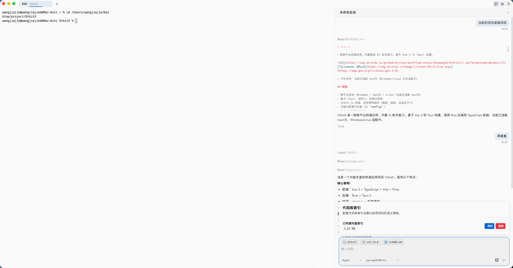
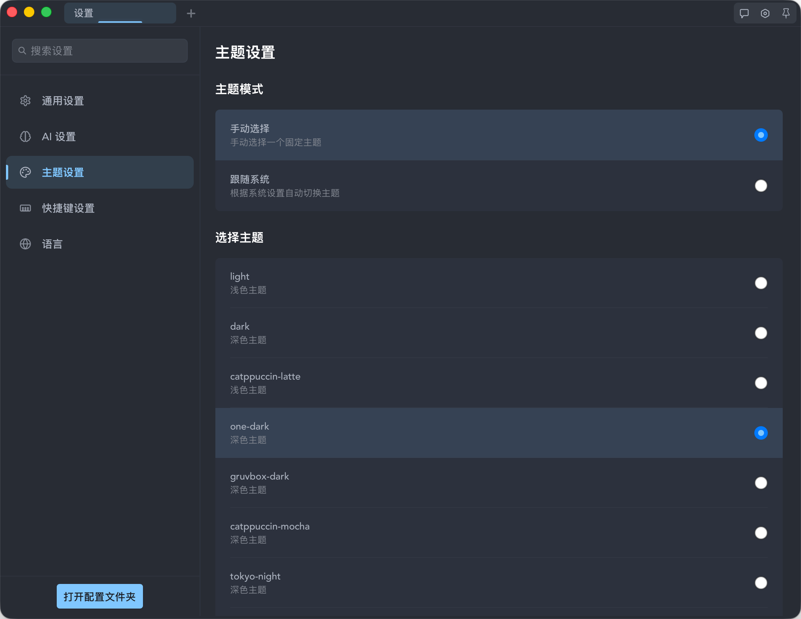

# OrbitX

[中文](./README_zh.md) | English

A cross-platform terminal application with built-in AI assistant capabilities. Built with Vue 3 and Tauri.


[](https://www.gnu.org/licenses/gpl-3.0)
[](https://github.com/Skywang16/OrbitX/releases)

> Platform Support: Currently macOS only (Windows/Linux support coming soon)

## Features

- Cross-platform: Windows / macOS / Linux (currently macOS only)
- Built with Tauri - small size, low resource usage
- xterm.js terminal with plugins (search, links, auto-fit)
- Customizable themes and configuration (see `config/`)
- AI assistant integration with multiple providers
- State management with Pinia

## Screenshots





## Tech Stack

- Frontend: Vue 3 + TypeScript + Vite
- Desktop Framework: Tauri 2
- Terminal: xterm.js
- State Management: Pinia
- Backend (Tauri): Rust

## Prerequisites

- Node.js 18+
- Rust stable (recommended to match CI version)
- System dependencies:
  - macOS: Xcode Command Line Tools
  - Windows: Visual Studio Build Tools (with C++ toolset), WebView2 Runtime
  - Ubuntu/Debian: `libgtk-3-dev libwebkit2gtk-4.0-dev libappindicator3-dev librsvg2-dev patchelf`

## Installation

```bash
git clone https://github.com/Skywang16/OrbitX.git
cd OrbitX
npm install
```

### Optional: Install Tauri CLI

```bash
npm install -g @tauri-apps/cli
```

## Development

```bash
# Start frontend dev server
npm run dev

# In another terminal, start Tauri in dev mode
npm run tauri dev
```

## Build

```bash
# Build frontend (type check + bundle)
npm run build

# Build Tauri app (see CI/Release for platform dependencies)
npm run tauri build
```

## Project Structure

```text
orbitx/
├── src/                     # Frontend source code (Vue 3 + TS + Vite)
│   ├── api/                 # API declarations for Tauri/Rust
│   ├── components/          # Vue components
│   ├── composables/         # Reusable hooks (useXxx)
│   ├── constants/           # Constants
│   ├── stores/              # Pinia state management
│   ├── types/               # TypeScript type definitions
│   └── ...
├── src-tauri/               # Tauri/Rust backend
```

## Configuration

- Themes: `config/themes/*.toml`
- Global config: `config/config.toml`

## Usage

Common operations:

- Multiple tabs with search (xterm.js plugins)
- Theme switching with system sync
- Keyboard shortcuts (copy/paste/search, tab management, etc.)

## 📋 Development Status

### ✅ Implemented

- **Terminal Core**: xterm.js-based terminal emulation with multi-tab management
- **AI Assistant**: Integration with multiple AI models (OpenAI, Claude, Gemini, etc.) with agent capabilities
- **Smart Completion**: Command completion, file path completion, Git/NPM integration
- **Theme System**: Multiple built-in themes with light/dark mode support
- **Data Storage**: AI conversation history storage

### 🚧 In Progress

- **Cross-platform Support**: Windows and Linux adaptation
- **UI Improvements**: Settings interface enhancement, UX optimization

### 📅 Planned

- **Split Pane**: Terminal window splitting support
- **Session Management**: Session save and restore
- **Sidecar AI**: Seamless local sidecar AI for real-time I/O analysis

## Scripts

- `npm run dev`: Frontend development (use with `npm run tauri dev`)
- `npm run build`: Type check + bundle
- `npm run lint:check`: ESLint check
- `npm run format:check`: Prettier check

## CI/Release

- CI: See `.github/workflows/ci.yml` (lint/format/build)
- Release: Pushing a `v*` tag triggers `.github/workflows/release.yml` to build and release on macOS/Windows/Ubuntu

Note: If the repository name or owner changes, please update badges and links accordingly.

## Acknowledgments

- [Tauri](https://tauri.app/)
- [Vue.js](https://vuejs.org/)
- [xterm.js](https://xtermjs.org/)

## Contact

For issues and suggestions, please create an [Issue](https://github.com/Skywang16/OrbitX/issues).

## License

This project is licensed under GPL-3.0-or-later. See the `LICENSE` file for details.

---

⭐ If this project helps you, please give it a star!
