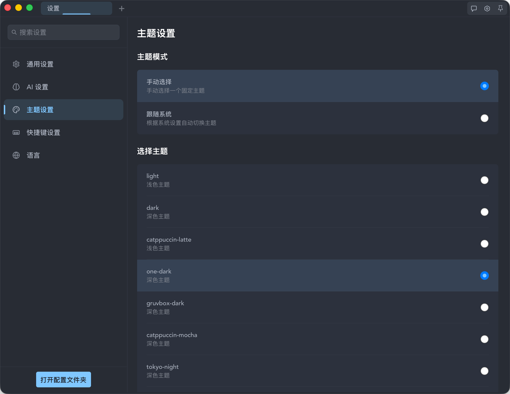

# OrbitX

中文 | [English](./README.md)

一款跨平台终端应用，内置基础 AI 助手能力。基于 Vue 3 与 Tauri 构建。


[](https://www.gnu.org/licenses/gpl-3.0)
[](https://github.com/Skywang16/OrbitX/releases)

> 平台支持：当前仅适配 macOS（Windows/Linux 正在适配中）

## 特性

- 跨平台目标：Windows / macOS / Linux（当前仅适配 macOS）
- 基于 Tauri，体积小、资源占用低
- xterm.js 终端，支持常用插件（搜索、链接、自适应尺寸）
- 主题与配置可定制（见 `config/`）
- 集成多种 AI 助手
- Pinia 管理应用状态

## 预览




## 技术栈

- 前端：Vue 3 + TypeScript + Vite
- 桌面框架：Tauri 2
- 终端：xterm.js
- 状态管理：Pinia
- 后端（Tauri）：Rust

## 开发环境与依赖

- Node.js 18+
- Rust stable（建议与 CI 一致）
- 系统依赖：
  - macOS：Xcode Command Line Tools
  - Windows：Visual Studio Build Tools（含 C++ 工具集）、WebView2 Runtime
  - Ubuntu/Debian：`libgtk-3-dev libwebkit2gtk-4.0-dev libappindicator3-dev librsvg2-dev patchelf`

## 安装

```bash
git clone https://github.com/Skywang16/OrbitX.git
cd OrbitX
npm install
```

### 可选：安装 Tauri CLI

```bash
npm install -g @tauri-apps/cli
```

## 本地开发

```bash
# 启动前端开发服务器
npm run dev

# 在另一个终端启动 Tauri 开发模式
npm run tauri dev
```

## 构建

```bash
# 构建前端（类型检查 + 打包）
npm run build

# 构建 Tauri 应用（多平台依赖见下文 CI/Release）
npm run tauri build
```

## 项目结构

```text
orbitx/
├── src/                     # 前端源代码（Vue 3 + TS + Vite）
│   ├── api/                 # 前端与 Tauri/Rust 的 API 声明
│   ├── components/          # Vue 组件
│   ├── composables/         # 可复用 hooks（useXxx）
│   ├── constants/           # 常量
│   ├── stores/              # Pinia 状态管理
│   ├── types/               # TypeScript 类型定义
│   └── ...
├── src-tauri/               # Tauri/Rust 后端
```

## 配置

- 主题：`config/themes/*.json`
- 全局配置：`config.json`（运行时位于应用数据目录）

## 使用

常见操作：

- 多标签页与搜索（xterm.js 插件）
- 主题切换与跟随系统
- 快捷键（复制/粘贴/搜索、标签页管理等）

## 📋 开发状态

### ✅ 已实现功能

- **终端核心**: 基于 xterm.js 的终端模拟，多标签页管理
- **AI 助手**: 集成多种 AI 模型（OpenAI、Claude、Gemini 等），实现 agent 能力
- **智能补全**: 命令补全、文件路径补全、Git/NPM 集成
- **主题系统**: 多种内置主题，支持亮色/暗色模式
- **数据存储**: AI 历史会话存储

### 🚧 开发中

- **跨平台支持**: Windows 和 Linux 平台适配
- **界面优化**: 设置界面改进，用户体验提升

### 📅 计划开发

- **分屏功能**: 支持终端窗口分割
- **会话管理**: 会话保存与恢复
- **边车 AI**: 无感知的本地边车 AI，实时分析用户输入输出

## 脚本

- `npm run dev`：前端开发（结合 `npm run tauri dev`）
- `npm run build`：类型检查 + 打包
- `npm run lint:check`：ESLint 检查
- `npm run format:check`：Prettier 检查

## CI/Release

- CI：见 `.github/workflows/ci.yml`（lint/format/build）
- Release：推送 `v*` 标签将触发 `.github/workflows/release.yml`，在 macOS/Windows/Ubuntu 构建并发布

注意：如果仓库名称或所有者更改，请相应更新徽章和链接。

## 致谢

- [Tauri](https://tauri.app/)
- [Vue.js](https://vuejs.org/)
- [xterm.js](https://xtermjs.org/)

## 联系

如有问题和建议，请创建 [Issue](https://github.com/Skywang16/OrbitX/issues)。

## 许可

本项目以 GPL-3.0-or-later 授权。详见 `LICENSE` 文件。

---

⭐ 如果这个项目对你有帮助，请给它一个 star！
