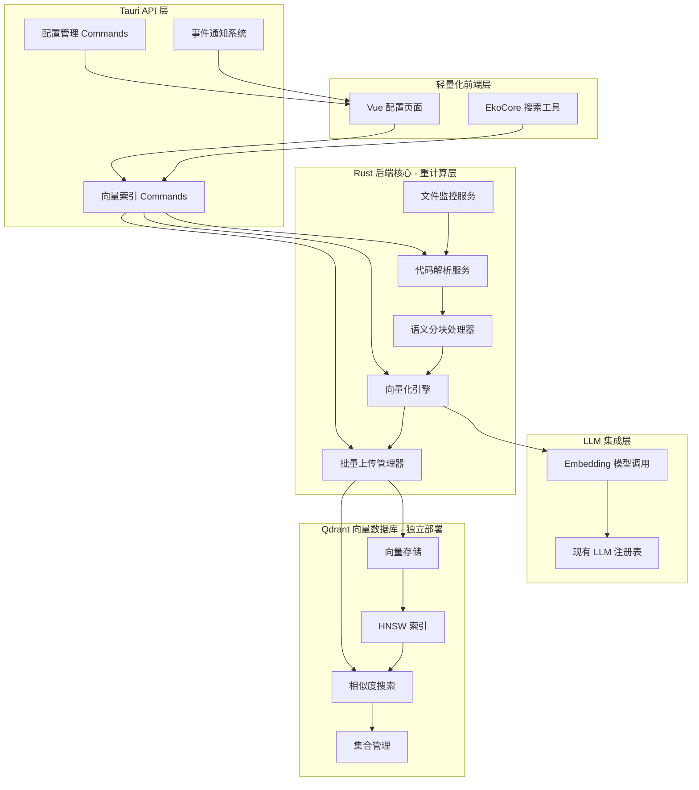
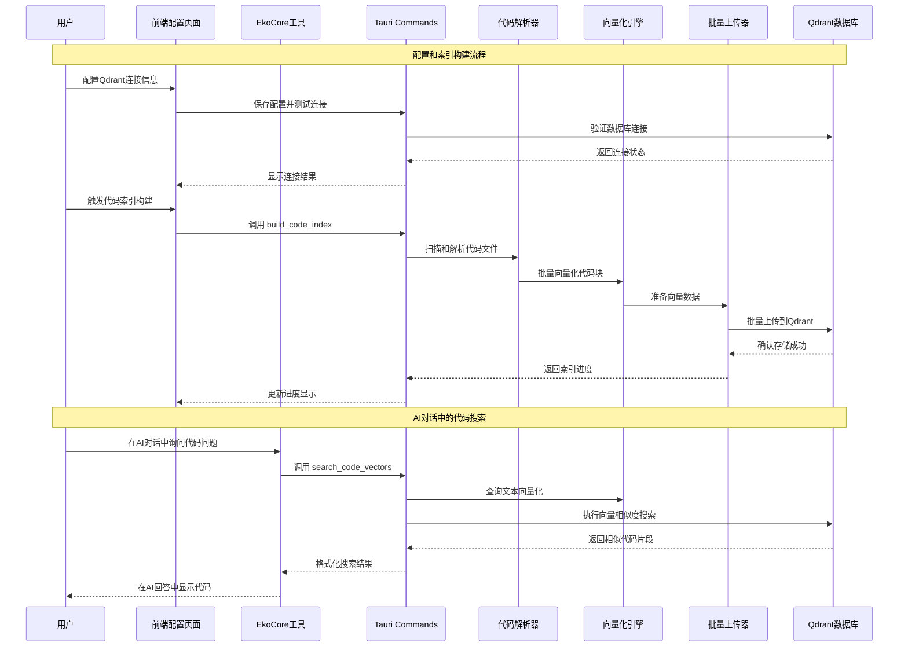

# 代码向量索引系统 Design Document

## Overview

本设计文档描述了基于OrbitX现有架构的代码向量索引系统。系统采用**重后端、轻前端**的设计原则：Rust后端负责所有重计算任务（代码解析、向量化、批量处理），Qdrant作为独立的专业向量数据库，TypeScript前端仅提供配置界面和调用接口。

## Architecture

### Overall Architecture Diagram



### Data Flow Architecture



### Technology Stack Selection

- **核心架构**: 基于现有OrbitX技术栈
  - **前端**: Vue 3 + Tauri (现有)
  - **后端**: Rust + Tauri (现有)
  - **AI框架**: EkoCore TypeScript (现有)

- **向量数据库**: Qdrant (独立部署)
  - **版本**: v1.8+
  - **部署**: Docker容器或云端托管
  - **客户端**: qdrant-client Rust crate

- **代码解析**: Tree-sitter
  - **集成**: 使用OrbitX现有tree-sitter依赖
  - **语言支持**: TypeScript、Rust、Python、JavaScript、Go等

- **向量化**: 重用现有LLM集成
  - **模型**: 通过LLM注册表调用embedding模型
  - **API**: OpenAI、Ollama等现有配置

## Components and Interfaces

### 1. Rust后端 - 核心计算层

#### VectorIndexService.rs

```rust
use qdrant_client::{
    client::QdrantClient,
    qdrant::{
        CreateCollectionBuilder, Distance, VectorParamsBuilder,
        PointStruct, SearchPointsBuilder, CollectionOperationResponse
    }
};
use serde::{Serialize, Deserialize};
use std::collections::HashMap;
use tokio::sync::RwLock;
use tree_sitter::{Language, Parser, Node};

/// 向量索引服务 - 后端核心
pub struct VectorIndexService {
    client: QdrantClient,
    collection_name: String,
    config: VectorIndexConfig,
    llm_service: Arc<LLMService>, // 重用现有LLM服务
    parsers: HashMap<String, Language>,
}

#[derive(Debug, Clone, Serialize, Deserialize)]
pub struct VectorIndexConfig {
    pub qdrant_url: String,
    pub qdrant_api_key: Option<String>,
    pub collection_name: String,
    pub vector_size: usize,
    pub batch_size: usize,
    pub supported_extensions: Vec<String>,
    pub ignore_patterns: Vec<String>,
}

#[derive(Debug, Clone, Serialize, Deserialize)]
pub struct CodeVector {
    pub id: String,
    pub file_path: String,
    pub content: String,
    pub start_line: u32,
    pub end_line: u32,
    pub language: String,
    pub chunk_type: String, // function, class, method, etc.
    pub vector: Vec<f32>,
}

#[derive(Debug, Clone, Serialize, Deserialize)]
pub struct SearchOptions {
    pub query: String,
    pub max_results: Option<usize>,
    pub min_score: Option<f32>,
    pub directory_filter: Option<String>,
    pub language_filter: Option<String>,
}

impl VectorIndexService {
    /// 创建新的向量索引服务
    pub async fn new(
        config: VectorIndexConfig,
        llm_service: Arc<LLMService>
    ) -> Result<Self, Box<dyn std::error::Error>> {
        // 连接Qdrant数据库
        let client = QdrantClient::from_url(&config.qdrant_url)
            .with_api_key(config.qdrant_api_key.clone())
            .build()?;

        // 初始化语言解析器
        let mut parsers = HashMap::new();
        parsers.insert("typescript".to_string(), tree_sitter_typescript::language_typescript());
        parsers.insert("javascript".to_string(), tree_sitter_javascript::language());
        parsers.insert("rust".to_string(), tree_sitter_rust::language());
        parsers.insert("python".to_string(), tree_sitter_python::language());

        let service = Self {
            client,
            collection_name: config.collection_name.clone(),
            config,
            llm_service,
            parsers,
        };

        // 初始化Qdrant集合
        service.initialize_collection().await?;

        Ok(service)
    }

    /// 初始化Qdrant向量集合
    async fn initialize_collection(&self) -> Result<(), Box<dyn std::error::Error>> {
        // 检查集合是否存在
        let collections = self.client.list_collections().await?;
        let exists = collections.collections.iter()
            .any(|c| c.name == self.collection_name);

        if !exists {
            // 创建新集合
            let create_collection = CreateCollectionBuilder::new(&self.collection_name)
                .vectors_config(VectorParamsBuilder::new(
                    self.config.vector_size as u64,
                    Distance::Cosine
                ))
                .build();

            self.client.create_collection(create_collection).await?;

            tracing::info!("Created Qdrant collection: {}", self.collection_name);
        }

        Ok(())
    }

    /// 构建代码索引 - 主要入口
    pub async fn build_index(
        &self,
        workspace_path: &str
    ) -> Result<IndexStats, Box<dyn std::error::Error>> {
        let start_time = std::time::Instant::now();
        let mut total_files = 0;
        let mut total_chunks = 0;

        // 1. 扫描代码文件
        let files = self.scan_code_files(workspace_path).await?;
        total_files = files.len();

        // 2. 批量处理文件
        let mut all_vectors = Vec::new();

        for chunk in files.chunks(self.config.batch_size) {
            let mut batch_vectors = Vec::new();

            // 并行处理一批文件
            let handles: Vec<_> = chunk.iter().map(|file_path| {
                let service = self.clone(); // 假设实现了Clone
                let path = file_path.clone();
                tokio::spawn(async move {
                    service.process_single_file(&path).await
                })
            }).collect();

            // 等待批次完成
            for handle in handles {
                match handle.await? {
                    Ok(mut vectors) => {
                        total_chunks += vectors.len();
                        batch_vectors.append(&mut vectors);
                    }
                    Err(e) => {
                        tracing::warn!("Failed to process file: {}", e);
                    }
                }
            }

            all_vectors.append(&mut batch_vectors);
        }

        // 3. 批量上传到Qdrant
        self.upload_vectors_batch(all_vectors).await?;

        Ok(IndexStats {
            total_files,
            total_chunks,
            processing_time: start_time.elapsed(),
        })
    }

    /// 批量上传向量到Qdrant
    async fn upload_vectors_batch(
        &self,
        vectors: Vec<CodeVector>
    ) -> Result<(), Box<dyn std::error::Error>> {
        let batch_size = 1000; // Qdrant推荐的批量大小

        for chunk in vectors.chunks(batch_size) {
            let points: Vec<PointStruct> = chunk.iter()
                .map(|vector| {
                    let mut payload = HashMap::new();
                    payload.insert("file_path".to_string(), vector.file_path.clone().into());
                    payload.insert("content".to_string(), vector.content.clone().into());
                    payload.insert("start_line".to_string(), (vector.start_line as i64).into());
                    payload.insert("end_line".to_string(), (vector.end_line as i64).into());
                    payload.insert("language".to_string(), vector.language.clone().into());
                    payload.insert("chunk_type".to_string(), vector.chunk_type.clone().into());

                    PointStruct::new(
                        vector.id.clone(),
                        vector.vector.clone(),
                        payload
                    )
                })
                .collect();

            // 上传到Qdrant
            self.client
                .upsert_points(&self.collection_name, points, None)
                .await?;
        }

        Ok(())
    }

    /// 向量搜索
    pub async fn search_vectors(
        &self,
        options: SearchOptions
    ) -> Result<Vec<SearchResult>, Box<dyn std::error::Error>> {
        // 1. 将查询向量化
        let query_vector = self.llm_service
            .create_embedding(&options.query)
            .await?;

        // 2. 构建Qdrant搜索请求
        let mut search_builder = SearchPointsBuilder::new(
            &self.collection_name,
            query_vector,
            options.max_results.unwrap_or(10) as u64
        );

        if let Some(min_score) = options.min_score {
            search_builder = search_builder.score_threshold(min_score);
        }

        // 3. 执行搜索
        let search_result = self.client
            .search_points(search_builder.build())
            .await?;

        // 4. 格式化结果
        let results: Vec<SearchResult> = search_result.result
            .into_iter()
            .map(|scored_point| {
                let payload = scored_point.payload;
                SearchResult {
                    file_path: payload.get("file_path")
                        .and_then(|v| v.as_str())
                        .unwrap_or("")
                        .to_string(),
                    content: payload.get("content")
                        .and_then(|v| v.as_str())
                        .unwrap_or("")
                        .to_string(),
                    start_line: payload.get("start_line")
                        .and_then(|v| v.as_integer())
                        .unwrap_or(0) as u32,
                    end_line: payload.get("end_line")
                        .and_then(|v| v.as_integer())
                        .unwrap_or(0) as u32,
                    language: payload.get("language")
                        .and_then(|v| v.as_str())
                        .unwrap_or("")
                        .to_string(),
                    chunk_type: payload.get("chunk_type")
                        .and_then(|v| v.as_str())
                        .unwrap_or("")
                        .to_string(),
                    score: scored_point.score,
                }
            })
            .collect();

        Ok(results)
    }
}

#[derive(Debug, Serialize)]
pub struct IndexStats {
    pub total_files: usize,
    pub total_chunks: usize,
    pub processing_time: std::time::Duration,
}

#[derive(Debug, Clone, Serialize, Deserialize)]
pub struct SearchResult {
    pub file_path: String,
    pub content: String,
    pub start_line: u32,
    pub end_line: u32,
    pub language: String,
    pub chunk_type: String,
    pub score: f32,
}
```

### 2. Tauri命令接口层

```rust
use tauri::State;
use serde::{Serialize, Deserialize};

/// 向量索引服务状态
pub struct VectorIndexState {
    service: Arc<RwLock<Option<VectorIndexService>>>,
}

/// 初始化向量索引服务
#[tauri::command]
pub async fn init_vector_index(
    config: VectorIndexConfig,
    state: State<'_, VectorIndexState>,
    llm_state: State<'_, LLMManagerState>, // 重用现有LLM服务
) -> Result<(), String> {
    let llm_service = llm_state.get_service().clone();

    match VectorIndexService::new(config, llm_service).await {
        Ok(service) => {
            *state.service.write().await = Some(service);
            Ok(())
        }
        Err(e) => Err(format!("Failed to initialize vector index: {}", e))
    }
}

/// 构建代码索引
#[tauri::command]
pub async fn build_code_index(
    workspace_path: String,
    state: State<'_, VectorIndexState>,
) -> Result<IndexStats, String> {
    let service_guard = state.service.read().await;

    if let Some(service) = service_guard.as_ref() {
        service.build_index(&workspace_path)
            .await
            .map_err(|e| format!("Failed to build index: {}", e))
    } else {
        Err("Vector index service not initialized".to_string())
    }
}

/// 搜索代码向量
#[tauri::command]
pub async fn search_code_vectors(
    options: SearchOptions,
    state: State<'_, VectorIndexState>,
) -> Result<Vec<SearchResult>, String> {
    let service_guard = state.service.read().await;

    if let Some(service) = service_guard.as_ref() {
        service.search_vectors(options)
            .await
            .map_err(|e| format!("Failed to search vectors: {}", e))
    } else {
        Err("Vector index service not initialized".to_string())
    }
}

/// 测试Qdrant数据库连接
#[tauri::command]
pub async fn test_qdrant_connection(
    config: VectorIndexConfig,
) -> Result<String, String> {
    let client = QdrantClient::from_url(&config.qdrant_url)
        .with_api_key(config.qdrant_api_key)
        .build()
        .map_err(|e| format!("Failed to create client: {}", e))?;

    match client.health_check().await {
        Ok(_) => Ok("Connection successful".to_string()),
        Err(e) => Err(format!("Connection failed: {}", e))
    }
}
```

### 3. TypeScript前端 - 轻量化接口

#### CodeSearchTool.ts

````typescript
import { Tool, ToolResult } from '@/eko-core/types/tools.types'
import { AgentContext } from '@/eko-core/core/context'
import { NativeLLMToolCall, JSONSchema7 } from '@/eko-core/types'
import { invoke } from '@tauri-apps/api/core'

export class CodeSearchTool implements Tool {
  readonly name = 'search_code'
  readonly description = '在当前项目中搜索相关代码片段，支持语义搜索'

  readonly parameters: JSONSchema7 = {
    type: 'object',
    properties: {
      query: {
        type: 'string',
        description: '要搜索的代码描述或功能描述，支持自然语言',
      },
      maxResults: {
        type: 'number',
        description: '最大返回结果数量，默认10',
        default: 10,
      },
      directoryFilter: {
        type: 'string',
        description: '限制搜索的目录路径，例如 "src/components"',
      },
      languageFilter: {
        type: 'string',
        description: '限制搜索的编程语言，例如 "typescript"',
      },
    },
    required: ['query'],
  }

  async execute(
    args: {
      query: string
      maxResults?: number
      directoryFilter?: string
      languageFilter?: string
    },
    agentContext: AgentContext,
    toolCall: NativeLLMToolCall
  ): Promise<ToolResult> {
    try {
      // 调用Rust后端的向量搜索
      const searchOptions = {
        query: args.query,
        maxResults: args.maxResults || 10,
        minScore: 0.3, // 最小相似度阈值
        directoryFilter: args.directoryFilter,
        languageFilter: args.languageFilter,
      }

      const results = await invoke<SearchResult[]>('search_code_vectors', {
        options: searchOptions,
      })

      if (results.length === 0) {
        return {
          success: true,
          content: '没有找到相关的代码片段，请尝试使用不同的关键词或描述。',
          toolCallId: toolCall.id,
        }
      }

      // 格式化搜索结果
      const formattedResults = results
        .map((result, index) => {
          return (
            `**${index + 1}. ${result.filePath}** (${result.language}, 行 ${result.startLine}-${result.endLine})\n` +
            `相似度: ${(result.score * 100).toFixed(1)}%\n` +
            `类型: ${result.chunkType}\n` +
            '```' +
            result.language +
            '\n' +
            result.content +
            '\n' +
            '```\n'
          )
        })
        .join('\n---\n\n')

      const summary = `找到 ${results.length} 个相关代码片段：\n\n${formattedResults}`

      return {
        success: true,
        content: summary,
        toolCallId: toolCall.id,
      }
    } catch (error) {
      console.error('Code search failed:', error)

      return {
        success: false,
        content: `代码搜索失败: ${error}`,
        toolCallId: toolCall.id,
      }
    }
  }
}

interface SearchResult {
  filePath: string
  content: string
  startLine: number
  endLine: number
  language: string
  chunkType: string
  score: number
}
````

### 4. 配置集成

#### config.toml (集成到现有配置)

```toml
# 代码向量索引配置
[vector_index]
# 启用向量索引功能
enabled = true

# Qdrant数据库配置
[vector_index.qdrant]
url = "http://localhost:6333"
# api_key = "your-qdrant-api-key"  # 可选
collection_name = "orbitx-code-vectors"
timeout_seconds = 30

# 向量配置
[vector_index.vectors]
size = 1536  # 对应 text-embedding-3-small
distance = "Cosine"

# 处理配置
[vector_index.processing]
batch_size = 50
max_concurrent_files = 4
chunk_size_range = [10, 2000]  # 代码块字符数范围

# 支持的文件类型
[vector_index.files]
supported_extensions = [
  ".ts", ".tsx", ".js", ".jsx",
  ".rs", ".py", ".go", ".java",
  ".c", ".cpp", ".h", ".hpp"
]

ignore_patterns = [
  "**/node_modules/**",
  "**/target/**",
  "**/dist/**",
  "**/.git/**",
  "**/build/**"
]

# 搜索配置
[vector_index.search]
default_max_results = 10
default_min_score = 0.3
enable_result_cache = true
cache_ttl_seconds = 300
```

## Performance Considerations

### 计算密集任务后端化

- **代码解析**: 在Rust中使用Tree-sitter，避免前端阻塞
- **向量化**: 异步批量调用LLM API，支持并发处理
- **数据上传**: 使用Qdrant的批量API，每批次1000个向量

### 内存和资源管理

- **流式处理**: 避免加载过大文件到内存
- **并发控制**: 限制同时处理的文件数量
- **缓存策略**: 解析结果缓存，避免重复计算

### Qdrant优化配置

- **HNSW参数**: 针对代码搜索场景优化
- **存储**: 开启磁盘存储，支持大规模向量
- **索引**: 为过滤字段创建payload索引

## Error Handling and Resilience

### 分层错误处理

- **网络层**: Qdrant连接失败自动重试
- **处理层**: 单文件失败不影响整体进度
- **用户层**: 友好的错误信息和恢复建议

### 降级策略

- **Qdrant不可用**: 切换到基础文本搜索
- **LLM API限制**: 队列机制和退避策略
- **解析失败**: 回退到简单文本分块

这个设计完全符合你的架构要求：**Rust后端做重活，Qdrant做专业存储，前端做轻量接口**！
